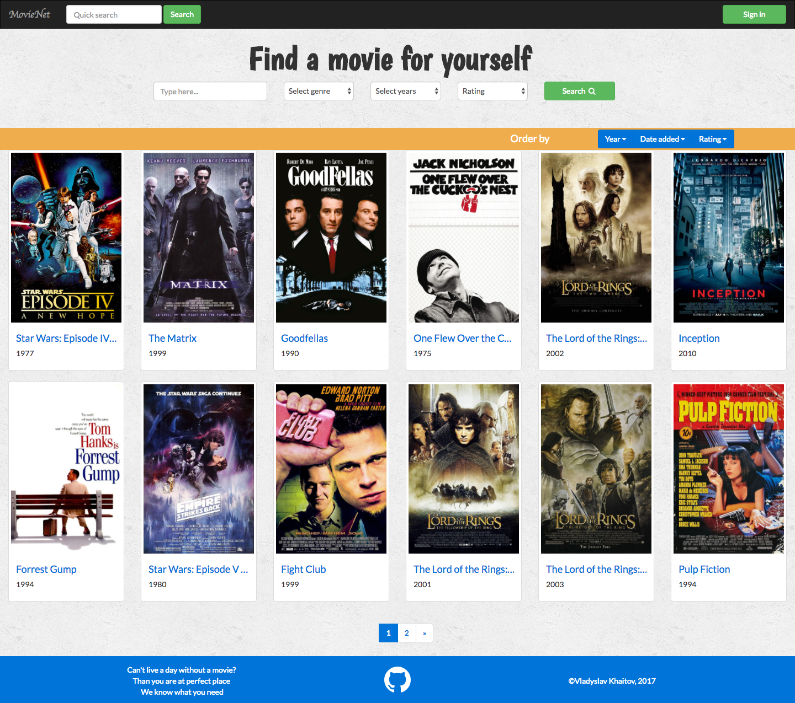
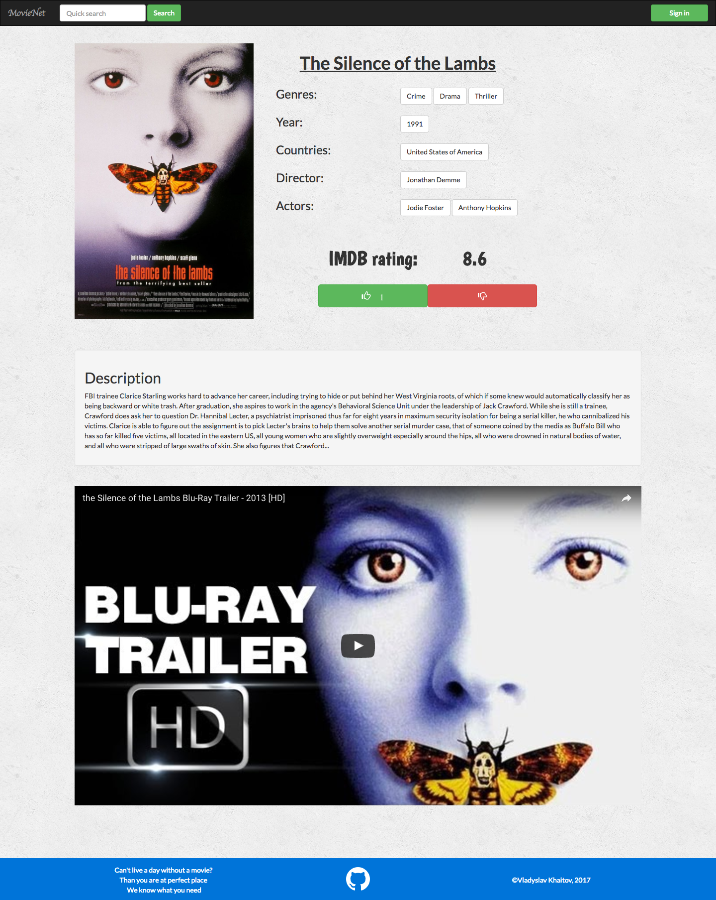
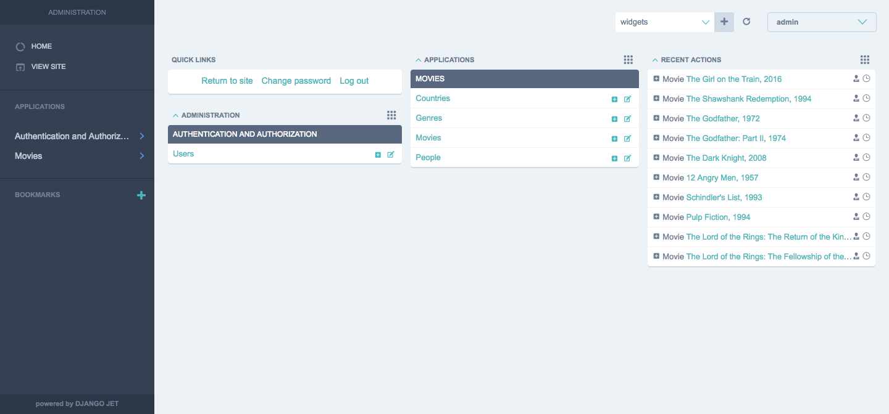

# MovieNet
[Website](https://movie-net.herokuapp.com/) with basic information about
movies, admin panel and very simple recommendation system.

## Technology stack
- python 3.6
- Django 1.10.5
- Bootstrap 3
- a little of jQuery and Ajax

## How to Contribute
Find any bugs or want to improve? Contributions are welcome!

- Fork this repository.

  

- Clone this repository to your desktop to make changes.
```sh
$ git clone {YOUR_REPOSITORY_CLONE_URL}
$ cd MovieNet
```
- Once you've pushed changes to your local repository, you can issue a
pull request by clicking on the pull request icon.

    

## Screenshots
#### Home page


#### Movie page


#### Admin



## License
The contents of this repository are covered under the [MIT License](LICENSE.txt).